# EntityRelationship

## Simple

**Input:**
```
erDiagram
    CUSTOMER ||--o{ ORDER : places
```
**Rendered by Naiad:**

<p align="center">
  
</p>

**Rendered by Mermaid:**
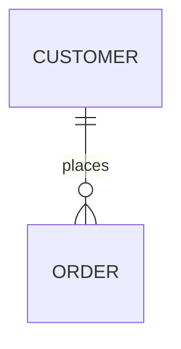

[Open in Mermaid Live](https://mermaid.live/edit#base64:eyJjb2RlIjoiZXJEaWFncmFtXG4gICAgQ1VTVE9NRVIgfHwtLW97IE9SREVSIDogcGxhY2VzIiwibWVybWFpZCI6eyJ0aGVtZSI6ImRlZmF1bHQifX0=)

## MultipleRelationships

**Input:**
```
erDiagram
    CUSTOMER ||--o{ ORDER : places
    ORDER ||--|{ LINE-ITEM : contains
    PRODUCT ||--o{ LINE-ITEM : includes
```
**Rendered by Naiad:**

<p align="center">
  
</p>

**Rendered by Mermaid:**
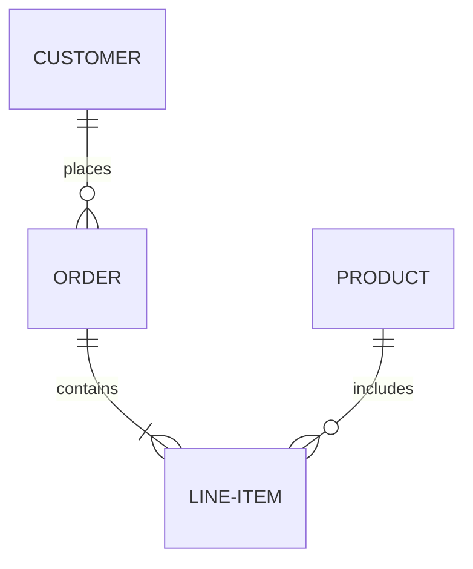

[Open in Mermaid Live](https://mermaid.live/edit#base64:eyJjb2RlIjoiZXJEaWFncmFtXG4gICAgQ1VTVE9NRVIgfHwtLW97IE9SREVSIDogcGxhY2VzXG4gICAgT1JERVIgfHwtLXx7IExJTkUtSVRFTSA6IGNvbnRhaW5zXG4gICAgUFJPRFVDVCB8fC0tb3sgTElORS1JVEVNIDogaW5jbHVkZXMiLCJtZXJtYWlkIjp7InRoZW1lIjoiZGVmYXVsdCJ9fQ==)

## Attributes

**Input:**
```
erDiagram
    CUSTOMER {
        string name
        string email
        int age
    }
```
**Rendered by Naiad:**

<p align="center">
  
</p>

**Rendered by Mermaid:**
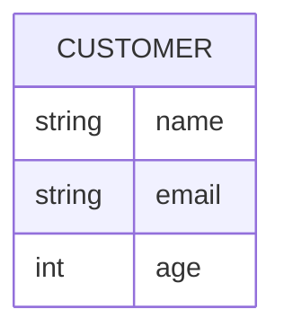

[Open in Mermaid Live](https://mermaid.live/edit#base64:eyJjb2RlIjoiZXJEaWFncmFtXG4gICAgQ1VTVE9NRVIge1xuICAgICAgICBzdHJpbmcgbmFtZVxuICAgICAgICBzdHJpbmcgZW1haWxcbiAgICAgICAgaW50IGFnZVxuICAgIH0iLCJtZXJtYWlkIjp7InRoZW1lIjoiZGVmYXVsdCJ9fQ==)

## KeyTypes

**Input:**
```
erDiagram
    CUSTOMER {
        int id PK
        string name
        string email UK
    }
```
**Rendered by Naiad:**

<p align="center">
  
</p>

**Rendered by Mermaid:**
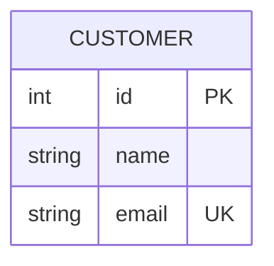

[Open in Mermaid Live](https://mermaid.live/edit#base64:eyJjb2RlIjoiZXJEaWFncmFtXG4gICAgQ1VTVE9NRVIge1xuICAgICAgICBpbnQgaWQgUEtcbiAgICAgICAgc3RyaW5nIG5hbWVcbiAgICAgICAgc3RyaW5nIGVtYWlsIFVLXG4gICAgfSIsIm1lcm1haWQiOnsidGhlbWUiOiJkZWZhdWx0In19)

## Comments

**Input:**
```
erDiagram
    CUSTOMER {
        int id PK "Primary key"
        string name "Customer name"
    }
```
**Rendered by Naiad:**

<p align="center">
  
</p>

**Rendered by Mermaid:**
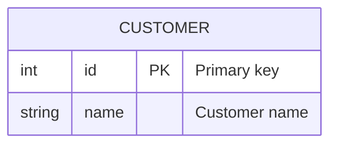

[Open in Mermaid Live](https://mermaid.live/edit#base64:eyJjb2RlIjoiZXJEaWFncmFtXG4gICAgQ1VTVE9NRVIge1xuICAgICAgICBpbnQgaWQgUEsgXHUwMDIyUHJpbWFyeSBrZXlcdTAwMjJcbiAgICAgICAgc3RyaW5nIG5hbWUgXHUwMDIyQ3VzdG9tZXIgbmFtZVx1MDAyMlxuICAgIH0iLCJtZXJtYWlkIjp7InRoZW1lIjoiZGVmYXVsdCJ9fQ==)

## LowercaseKeyTypes

**Input:**
```
erDiagram
    CUSTOMER {
        int id pk
        int region_id fk
        string email uk
    }
```
**Rendered by Naiad:**

<p align="center">
  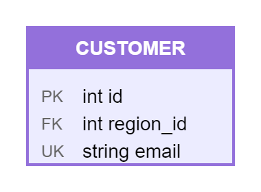
</p>

**Rendered by Mermaid:**
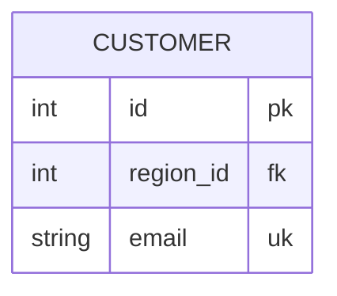

[Open in Mermaid Live](https://mermaid.live/edit#base64:eyJjb2RlIjoiZXJEaWFncmFtXG4gICAgQ1VTVE9NRVIge1xuICAgICAgICBpbnQgaWQgcGtcbiAgICAgICAgaW50IHJlZ2lvbl9pZCBma1xuICAgICAgICBzdHJpbmcgZW1haWwgdWtcbiAgICB9IiwibWVybWFpZCI6eyJ0aGVtZSI6ImRlZmF1bHQifX0=)

## SizedTypes

**Input:**
```
erDiagram
    PRODUCT {
        int id PK
        nvarchar(200) name
        decimal(18,2) price
        varchar(max)(nullable) notes
        string? sku "Optional"
    }
```
**Rendered by Naiad:**

<p align="center">
  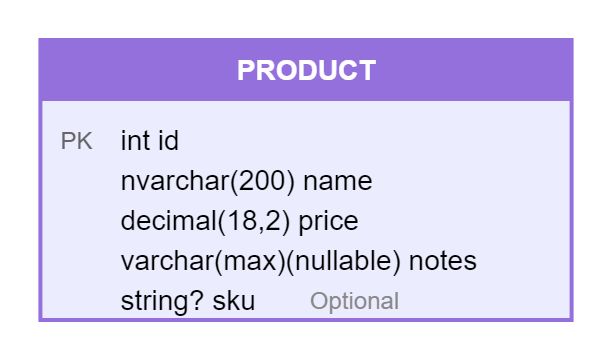
</p>

**Rendered by Mermaid:**
```mermaid
erDiagram
    PRODUCT {
        int id PK
        nvarchar(200) name
        decimal(18,2) price
        varchar(max)(nullable) notes
        string? sku "Optional"
    }
```

[Open in Mermaid Live](https://mermaid.live/edit#base64:eyJjb2RlIjoiZXJEaWFncmFtXG4gICAgUFJPRFVDVCB7XG4gICAgICAgIGludCBpZCBQS1xuICAgICAgICBudmFyY2hhcigyMDApIG5hbWVcbiAgICAgICAgZGVjaW1hbCgxOCwyKSBwcmljZVxuICAgICAgICB2YXJjaGFyKG1heCkobnVsbGFibGUpIG5vdGVzXG4gICAgICAgIHN0cmluZz8gc2t1IFx1MDAyMk9wdGlvbmFsXHUwMDIyXG4gICAgfSIsIm1lcm1haWQiOnsidGhlbWUiOiJkZWZhdWx0In19)

## Alias

**Input:**
```
erDiagram
    CUSTOMER["Customer Account"] {
        int id PK
        string name
    }
    ORDER[Purchase] {
        int id PK
        int customer_id FK
    }
    CUSTOMER ||--o{ ORDER : places
```
**Rendered by Naiad:**

<p align="center">
  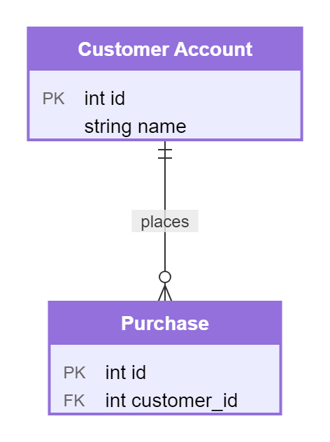
</p>

**Rendered by Mermaid:**
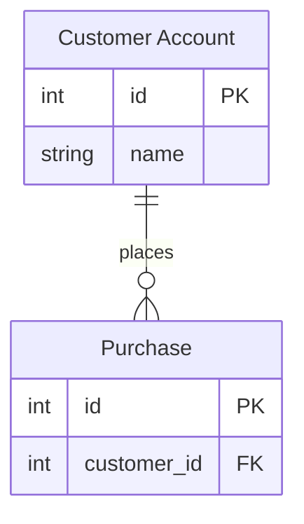

[Open in Mermaid Live](https://mermaid.live/edit#base64:eyJjb2RlIjoiZXJEaWFncmFtXG4gICAgQ1VTVE9NRVJbXHUwMDIyQ3VzdG9tZXIgQWNjb3VudFx1MDAyMl0ge1xuICAgICAgICBpbnQgaWQgUEtcbiAgICAgICAgc3RyaW5nIG5hbWVcbiAgICB9XG4gICAgT1JERVJbUHVyY2hhc2VdIHtcbiAgICAgICAgaW50IGlkIFBLXG4gICAgICAgIGludCBjdXN0b21lcl9pZCBGS1xuICAgIH1cbiAgICBDVVNUT01FUiB8fC0tb3sgT1JERVIgOiBwbGFjZXMiLCJtZXJtYWlkIjp7InRoZW1lIjoiZGVmYXVsdCJ9fQ==)

## AliasBold

**Input:**
```
erDiagram
    Company["**Company**"] {
        int Id pk
        nvarchar(200) Name
    }
    Employee["**Employee**: People who work here"] {
        int Id pk
        int CompanyId
    }
    Company ||--o{ Employee : "FK_Employee_Company"
```
**Rendered by Naiad:**

<p align="center">
  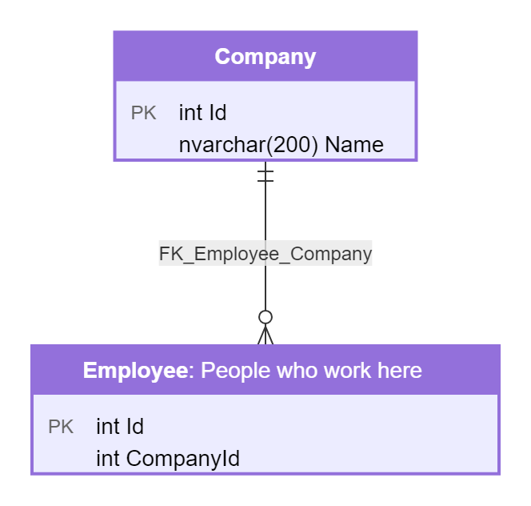
</p>

**Rendered by Mermaid:**
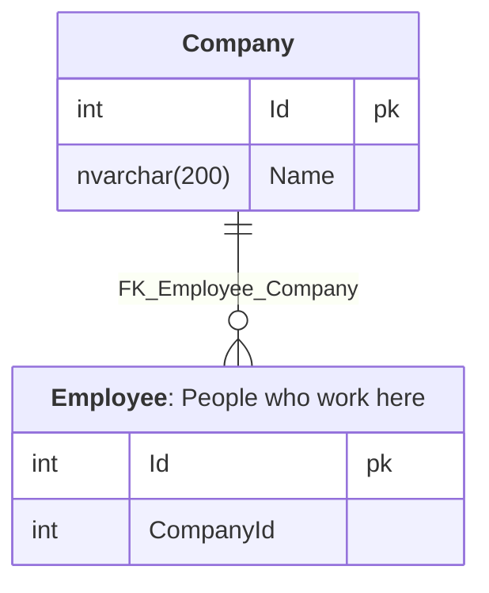

[Open in Mermaid Live](https://mermaid.live/edit#base64:eyJjb2RlIjoiZXJEaWFncmFtXG4gICAgQ29tcGFueVtcdTAwMjIqKkNvbXBhbnkqKlx1MDAyMl0ge1xuICAgICAgICBpbnQgSWQgcGtcbiAgICAgICAgbnZhcmNoYXIoMjAwKSBOYW1lXG4gICAgfVxuICAgIEVtcGxveWVlW1x1MDAyMioqRW1wbG95ZWUqKjogUGVvcGxlIHdobyB3b3JrIGhlcmVcdTAwMjJdIHtcbiAgICAgICAgaW50IElkIHBrXG4gICAgICAgIGludCBDb21wYW55SWRcbiAgICB9XG4gICAgQ29tcGFueSB8fC0tb3sgRW1wbG95ZWUgOiBcdTAwMjJGS19FbXBsb3llZV9Db21wYW55XHUwMDIyIiwibWVybWFpZCI6eyJ0aGVtZSI6ImRlZmF1bHQifX0=)

## SqlSchema

**Input:**
```
erDiagram
  Company["**Company**"] {
    int Id pk
    nvarchar(200) Name
  }
  Employee["**Employee**: People who work here"] {
    int Id pk "computed: the key"
    nvarchar(100) FirstName
    nvarchar(100)(nullable) LastName
    decimal(18,2) Salary
    int CompanyId
    int(nullable) ManagerId "reports to"
  }
  Order_Detail["**Order_Detail**"] {
    int Id pk
    int EmployeeId
    nvarchar(max)(nullable) Notes
  }
  Company ||--o{ Employee : "FK_Employee_Company"
  Employee ||--o{ Employee : "FK_Employee_Manager"
  Employee ||--o{ Order_Detail : "FK_OrderDetail_Employee"
```
**Rendered by Naiad:**

<p align="center">
  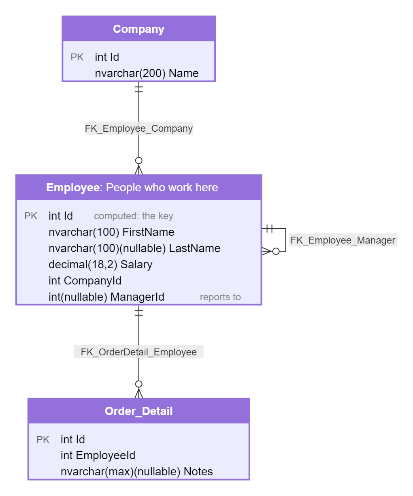
</p>

**Rendered by Mermaid:**
```mermaid
erDiagram
  Company["**Company**"] {
    int Id pk
    nvarchar(200) Name
  }
  Employee["**Employee**: People who work here"] {
    int Id pk "computed: the key"
    nvarchar(100) FirstName
    nvarchar(100)(nullable) LastName
    decimal(18,2) Salary
    int CompanyId
    int(nullable) ManagerId "reports to"
  }
  Order_Detail["**Order_Detail**"] {
    int Id pk
    int EmployeeId
    nvarchar(max)(nullable) Notes
  }
  Company ||--o{ Employee : "FK_Employee_Company"
  Employee ||--o{ Employee : "FK_Employee_Manager"
  Employee ||--o{ Order_Detail : "FK_OrderDetail_Employee"
```

[Open in Mermaid Live](https://mermaid.live/edit#base64:eyJjb2RlIjoiZXJEaWFncmFtXG4gIENvbXBhbnlbXHUwMDIyKipDb21wYW55KipcdTAwMjJdIHtcbiAgICBpbnQgSWQgcGtcbiAgICBudmFyY2hhcigyMDApIE5hbWVcbiAgfVxuICBFbXBsb3llZVtcdTAwMjIqKkVtcGxveWVlKio6IFBlb3BsZSB3aG8gd29yayBoZXJlXHUwMDIyXSB7XG4gICAgaW50IElkIHBrIFx1MDAyMmNvbXB1dGVkOiB0aGUga2V5XHUwMDIyXG4gICAgbnZhcmNoYXIoMTAwKSBGaXJzdE5hbWVcbiAgICBudmFyY2hhcigxMDApKG51bGxhYmxlKSBMYXN0TmFtZVxuICAgIGRlY2ltYWwoMTgsMikgU2FsYXJ5XG4gICAgaW50IENvbXBhbnlJZFxuICAgIGludChudWxsYWJsZSkgTWFuYWdlcklkIFx1MDAyMnJlcG9ydHMgdG9cdTAwMjJcbiAgfVxuICBPcmRlcl9EZXRhaWxbXHUwMDIyKipPcmRlcl9EZXRhaWwqKlx1MDAyMl0ge1xuICAgIGludCBJZCBwa1xuICAgIGludCBFbXBsb3llZUlkXG4gICAgbnZhcmNoYXIobWF4KShudWxsYWJsZSkgTm90ZXNcbiAgfVxuICBDb21wYW55IHx8LS1veyBFbXBsb3llZSA6IFx1MDAyMkZLX0VtcGxveWVlX0NvbXBhbnlcdTAwMjJcbiAgRW1wbG95ZWUgfHwtLW97IEVtcGxveWVlIDogXHUwMDIyRktfRW1wbG95ZWVfTWFuYWdlclx1MDAyMlxuICBFbXBsb3llZSB8fC0tb3sgT3JkZXJfRGV0YWlsIDogXHUwMDIyRktfT3JkZXJEZXRhaWxfRW1wbG95ZWVcdTAwMjIiLCJtZXJtYWlkIjp7InRoZW1lIjoiZGVmYXVsdCJ9fQ==)

## OneToOne

**Input:**
```
erDiagram
    PERSON ||--|| PASSPORT : has
```
**Rendered by Naiad:**

<p align="center">
  
</p>

**Rendered by Mermaid:**
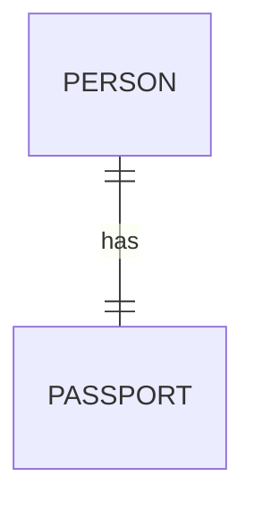

[Open in Mermaid Live](https://mermaid.live/edit#base64:eyJjb2RlIjoiZXJEaWFncmFtXG4gICAgUEVSU09OIHx8LS18fCBQQVNTUE9SVCA6IGhhcyIsIm1lcm1haWQiOnsidGhlbWUiOiJkZWZhdWx0In19)

## ZeroOrOne

**Input:**
```
erDiagram
    EMPLOYEE |o--o| PARKING-SPACE : uses
```
**Rendered by Naiad:**

<p align="center">
  
</p>

**Rendered by Mermaid:**
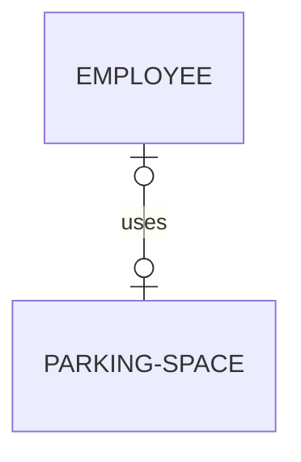

[Open in Mermaid Live](https://mermaid.live/edit#base64:eyJjb2RlIjoiZXJEaWFncmFtXG4gICAgRU1QTE9ZRUUgfG8tLW98IFBBUktJTkctU1BBQ0UgOiB1c2VzIiwibWVybWFpZCI6eyJ0aGVtZSI6ImRlZmF1bHQifX0=)

## NonIdentifying

**Input:**
```
erDiagram
    CUSTOMER ||..o{ ORDER : places
```
**Rendered by Naiad:**

<p align="center">
  
</p>

**Rendered by Mermaid:**
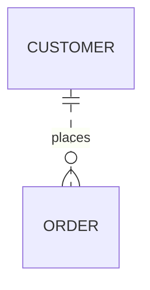

[Open in Mermaid Live](https://mermaid.live/edit#base64:eyJjb2RlIjoiZXJEaWFncmFtXG4gICAgQ1VTVE9NRVIgfHwuLm97IE9SREVSIDogcGxhY2VzIiwibWVybWFpZCI6eyJ0aGVtZSI6ImRlZmF1bHQifX0=)

## Compelx

**Input:**
```
erDiagram
CUSTOMER {
    int customer_id PK "Primary key"
    string first_name "Customer first name"
    string last_name "Customer last name"
    string email UK "Unique email address"
    date date_of_birth
    string phone
    boolean is_active
}

ADDRESS {
    int address_id PK
    int customer_id FK
    string street
    string city
    string state
    string postal_code
    string country
    string address_type "billing or shipping"
}

ORDER {
    int order_id PK
    int customer_id FK
    int shipping_address_id FK
    int billing_address_id FK
    datetime order_date
    datetime shipped_date
    string status
    decimal total_amount
}

ORDER_ITEM {
    int item_id PK
    int order_id FK
    int product_id FK
    int quantity
    decimal unit_price
    decimal discount
}

PRODUCT {
    int product_id PK
    int category_id FK
    string name
    string description
    decimal price
    int stock_quantity
    string sku UK
}

CATEGORY {
    int category_id PK
    int parent_id FK "Self-referencing"
    string name
    string description
}

CUSTOMER ||--o{ ORDER : places
CUSTOMER ||--o{ ADDRESS : has
ORDER ||--|{ ORDER_ITEM : contains
ORDER }o--|| ADDRESS : "ships to"
ORDER }o--|| ADDRESS : "bills to"
PRODUCT ||--o{ ORDER_ITEM : "included in"
CATEGORY ||--o{ PRODUCT : categorizes
CATEGORY |o--o| CATEGORY : "parent of"
```
**Rendered by Naiad:**

<p align="center">
  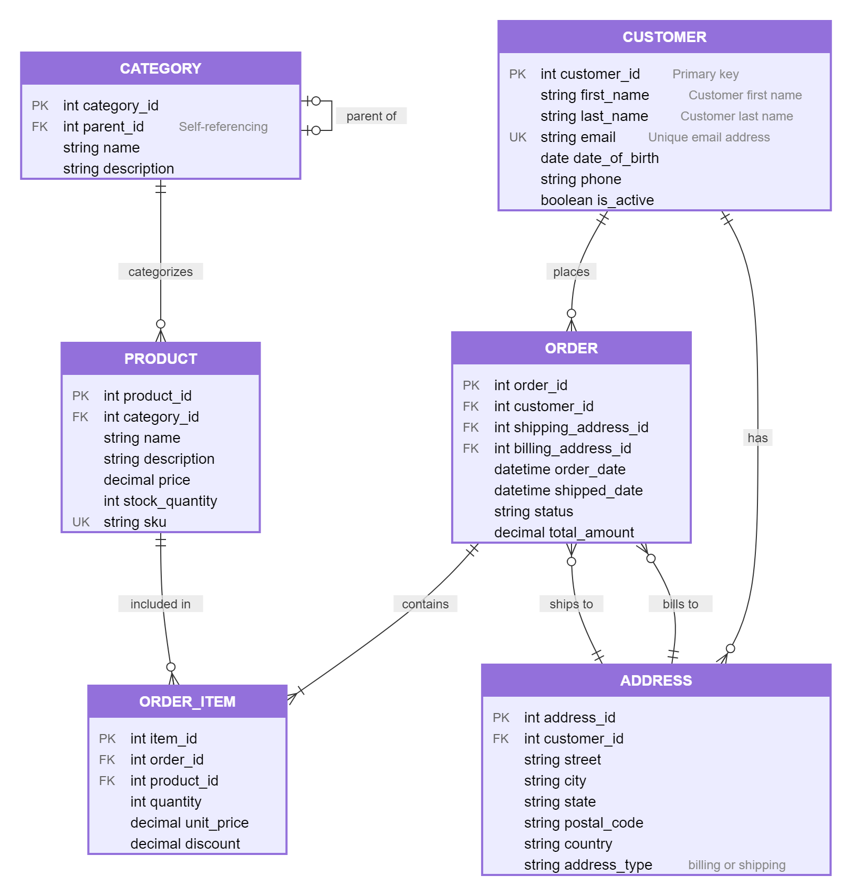
</p>

**Rendered by Mermaid:**
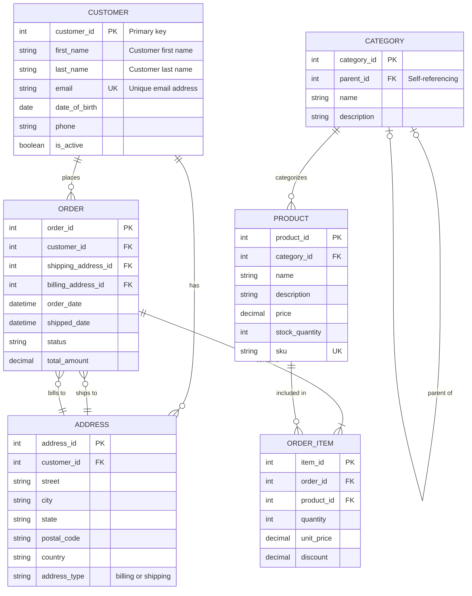

[Open in Mermaid Live](https://mermaid.live/edit#base64:eyJjb2RlIjoiZXJEaWFncmFtXG5DVVNUT01FUiB7XG4gICAgaW50IGN1c3RvbWVyX2lkIFBLIFx1MDAyMlByaW1hcnkga2V5XHUwMDIyXG4gICAgc3RyaW5nIGZpcnN0X25hbWUgXHUwMDIyQ3VzdG9tZXIgZmlyc3QgbmFtZVx1MDAyMlxuICAgIHN0cmluZyBsYXN0X25hbWUgXHUwMDIyQ3VzdG9tZXIgbGFzdCBuYW1lXHUwMDIyXG4gICAgc3RyaW5nIGVtYWlsIFVLIFx1MDAyMlVuaXF1ZSBlbWFpbCBhZGRyZXNzXHUwMDIyXG4gICAgZGF0ZSBkYXRlX29mX2JpcnRoXG4gICAgc3RyaW5nIHBob25lXG4gICAgYm9vbGVhbiBpc19hY3RpdmVcbn1cblxuQUREUkVTUyB7XG4gICAgaW50IGFkZHJlc3NfaWQgUEtcbiAgICBpbnQgY3VzdG9tZXJfaWQgRktcbiAgICBzdHJpbmcgc3RyZWV0XG4gICAgc3RyaW5nIGNpdHlcbiAgICBzdHJpbmcgc3RhdGVcbiAgICBzdHJpbmcgcG9zdGFsX2NvZGVcbiAgICBzdHJpbmcgY291bnRyeVxuICAgIHN0cmluZyBhZGRyZXNzX3R5cGUgXHUwMDIyYmlsbGluZyBvciBzaGlwcGluZ1x1MDAyMlxufVxuXG5PUkRFUiB7XG4gICAgaW50IG9yZGVyX2lkIFBLXG4gICAgaW50IGN1c3RvbWVyX2lkIEZLXG4gICAgaW50IHNoaXBwaW5nX2FkZHJlc3NfaWQgRktcbiAgICBpbnQgYmlsbGluZ19hZGRyZXNzX2lkIEZLXG4gICAgZGF0ZXRpbWUgb3JkZXJfZGF0ZVxuICAgIGRhdGV0aW1lIHNoaXBwZWRfZGF0ZVxuICAgIHN0cmluZyBzdGF0dXNcbiAgICBkZWNpbWFsIHRvdGFsX2Ftb3VudFxufVxuXG5PUkRFUl9JVEVNIHtcbiAgICBpbnQgaXRlbV9pZCBQS1xuICAgIGludCBvcmRlcl9pZCBGS1xuICAgIGludCBwcm9kdWN0X2lkIEZLXG4gICAgaW50IHF1YW50aXR5XG4gICAgZGVjaW1hbCB1bml0X3ByaWNlXG4gICAgZGVjaW1hbCBkaXNjb3VudFxufVxuXG5QUk9EVUNUIHtcbiAgICBpbnQgcHJvZHVjdF9pZCBQS1xuICAgIGludCBjYXRlZ29yeV9pZCBGS1xuICAgIHN0cmluZyBuYW1lXG4gICAgc3RyaW5nIGRlc2NyaXB0aW9uXG4gICAgZGVjaW1hbCBwcmljZVxuICAgIGludCBzdG9ja19xdWFudGl0eVxuICAgIHN0cmluZyBza3UgVUtcbn1cblxuQ0FURUdPUlkge1xuICAgIGludCBjYXRlZ29yeV9pZCBQS1xuICAgIGludCBwYXJlbnRfaWQgRksgXHUwMDIyU2VsZi1yZWZlcmVuY2luZ1x1MDAyMlxuICAgIHN0cmluZyBuYW1lXG4gICAgc3RyaW5nIGRlc2NyaXB0aW9uXG59XG5cbkNVU1RPTUVSIHx8LS1veyBPUkRFUiA6IHBsYWNlc1xuQ1VTVE9NRVIgfHwtLW97IEFERFJFU1MgOiBoYXNcbk9SREVSIHx8LS18eyBPUkRFUl9JVEVNIDogY29udGFpbnNcbk9SREVSIH1vLS18fCBBRERSRVNTIDogXHUwMDIyc2hpcHMgdG9cdTAwMjJcbk9SREVSIH1vLS18fCBBRERSRVNTIDogXHUwMDIyYmlsbHMgdG9cdTAwMjJcblBST0RVQ1QgfHwtLW97IE9SREVSX0lURU0gOiBcdTAwMjJpbmNsdWRlZCBpblx1MDAyMlxuQ0FURUdPUlkgfHwtLW97IFBST0RVQ1QgOiBjYXRlZ29yaXplc1xuQ0FURUdPUlkgfG8tLW98IENBVEVHT1JZIDogXHUwMDIycGFyZW50IG9mXHUwMDIyIiwibWVybWFpZCI6eyJ0aGVtZSI6ImRlZmF1bHQifX0=)

